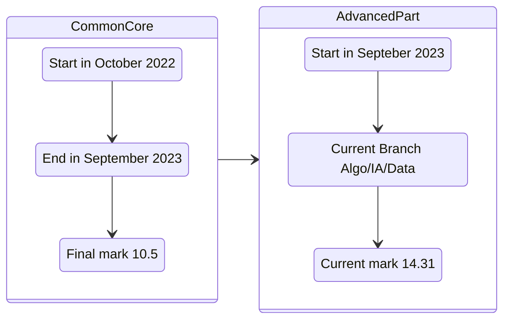
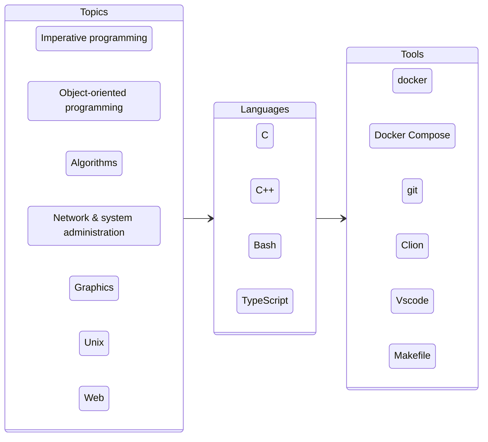

---

## School
### 42 cursus

```mermaid
stateDiagram
	direction LR
	state CommonCore {
		direction TB
		start: Start in October 2022
		end: End in September 2023
		final: Final mark 10.5

		start --> end
		end --> final
	}

	CommonCore --> AdvancedPart

	state AdvancedPart {
		direction TB
		A_start : Start in Septeber 2023
		A_branch : Current Branch Algo/IA/Data
		A_final : Current mark 14.31

		A_start --> A_branch
		A_branch --> A_final
	}
```

#### Common Core

```mermaid
stateDiagram
	direction LR

	state Topics {
		direction LR
		t1 : Imperative programming
		t2 : Object-oriented programming
		t3 : Algorithms
		t4 : Network & system administration
		t5 : Graphics
		t6 : Unix
		t7 : Web
	}

	state Languages {
		direction LR
		C
		C++
		Bash
		TypeScript
	}

	state Tools {
		direction  LR
		docker
		tool: Docker Compose
		git
		Clion
		Vscode
		Makefile
	}

	Topics --> Languages
	Languages --> Tools

```

#### Advanced Part

   
Toggle List Example

	### Heading
	1. ABC
	2. DEF
	   * Hello

---
## Professional experiences
